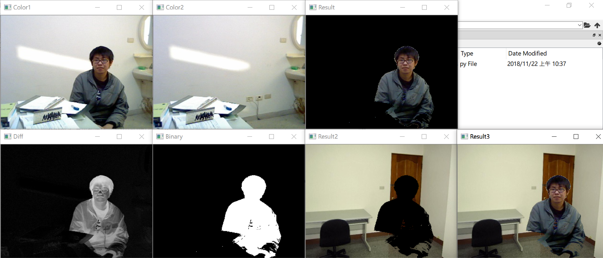

# 雜記
* 發放期中考卷

# 期末作業
* 繳交至 2018/1/10 12:00:00

## 期末報告
### 步驟
1. 到以下網址，找一篇有興趣的論文：[臺灣博碩士論文知識加值系統：自由的博碩士學位論文全文資料庫](https://ndltd.ncl.edu.tw/cgi-bin/gs32/gsweb.cgi/login?o=dwebmge)
    * 題目：可搜尋影像辨識、影像處理
2. 製作一個投影片，介紹他人研究的方法（不能直接複製論文內容或截圖）

### 規範
* 採分組，最多 3 人一組
* 報告時間：10~15 分鐘
* 只需要隊長上傳投影片，但要在封面上寫組員名字
* 在報告前一週需要繳交題目，避免撞題
* 不用看懂全部，但至少要知道是什麼問題
* 探討方法與結果
* 需要附上原本論文的作者與題目
* 基本上是找中文，但也能找英文的論文
* 期末也可以做虛擬攝影棚（去背＋增加背景）

## 期末專案
* 也能寫程式兼報告
* 報告 70 分以上，實作寫程式 80 分以上
    * 報告為多人（團隊），實作寫程式為單人
* 去年有人做魚眼效果、AR 影像

# C5
### 去背合成
```py
import cv2

path1 = 'C:/Users/lin/Desktop/pics/bgsub1.png'
path2 = 'C:/Users/lin/Desktop/pics/bgsub2.png'
path3 = 'C:/Users/lin/Desktop/pics/3e-1.jpg' # 新的背景
imgColor1 = cv2.imread(path1)
imgGray1 = cv2.cvtColor(imgColor1, cv2.COLOR_BGR2GRAY)
imgColor2 = cv2.imread(path2)
imgGray2 = cv2.cvtColor(imgColor2, cv2.COLOR_BGR2GRAY)
imgColor3 = cv2.imread(path3)
# 這邊的 imgColor3 有特地選擇相同大小的照片，若大小不同需調整
# rows, cols = imgGray1.shape
# imgSynthesis = cv2.resize(imgSynthesis, (cols, rows))

imgDiff = cv2.absdiff(imgGray1, imgGray2)
thread, imgBinary = cv2.threshold(imgDiff, 40, 255, cv2.THRESH_BINARY) # 二值化
imgResult = cv2.bitwise_and(imgColor1, imgColor1, mask = imgBinary)
imgResult2 = cv2.bitwise_and(imgColor3, imgColor3, mask = cv2.bitwise_not(imgBinary))
# cv2.bitwise_not(imgBinary) 可改寫成 255-imgBinary
imgResult3 = cv2.add(imgResult, imgResult2)

cv2.imshow('Color1', imgColor1)
cv2.imshow('Color2', imgColor2)
cv2.imshow('Diff', imgDiff)
cv2.imshow('Binary', imgBinary)
cv2.imshow('Result', imgResult)
cv2.imshow('Result2', imgResult2)
cv2.imshow('Result3', imgResult3)

cv2.waitKey(0)
cv2.destroyAllWindows()
```
