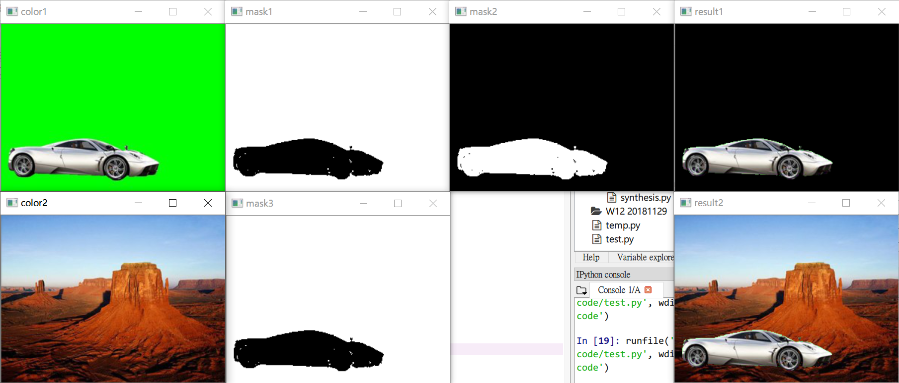

# C7
### 影像去背
```py
import cv2
import numpy as np

path1 = 'C:/Users/lin/Desktop/pics/pic1.jpg'
path2 = 'C:/Users/lin/Desktop/pics/pic2.jpg'
imgColor1 = cv2.imread(path1)
imgColor2 = cv2.imread(path2)

imgHSV = cv2.cvtColor(imgColor1, cv2.COLOR_BGR2HSV)
lowerHSV = np.array([55, 120, 0])
upperHSV = np.array([65, 255, 255])
imgMask1 = cv2.inRange(imgHSV, lowerHSV, upperHSV)
imgMask2 = cv2.bitwise_not(imgMask1)
imgResult1 = cv2.bitwise_and(imgColor1, imgColor1, mask = imgMask2)

imgMask3 = cv2.bitwise_not(imgMask2)
imgResult2 = cv2.bitwise_and(imgColor2, imgColor2, mask = imgMask3)
imgResult2 = cv2.add(imgResult1, imgResult2)

cv2.imshow('color1', imgColor1)
cv2.imshow('mask1', imgMask1)
cv2.imshow('mask2', imgMask2)
cv2.imshow('result1', imgResult1)
cv2.imshow('color2', imgColor2)
cv2.imshow('mask3', imgMask3)
cv2.imshow('result2', imgResult2)

cv2.waitKey(0)
cv2.destroyAllWindows()
```



### 視訊畫面
```py
import cv2

cap = cv2.VideoCapture(0) # 0 指的是視訊裝置的編號

while(1):
    ret, frame = cap.read()
    
    frame = cv2.resize(frame, (320, 240)) # 縮放解析度至 320 * 240
    
    # imgGray = cv2.cvtColor(frame, cv2.COLOR_BGR2GRAY) # 灰階影像
    # thresh, binary = cv2.threshold(imgGray, 128, 255, cv2.THRESH_BINARY) # 二值化
    # imgNot = cv2.bitwise_not(frame) # 負片
    imgCanny = cv2.Canny(frame, 100, 200)
    imgCanny = cv2.cvtColor(imgCanny, cv2.COLOR_GRAY2BGR)
    imgMixed = cv2.add(frame, imgCanny)
    
    cv2.imshow('frame', frame)
    # cv2.imshow('Gray', imgGray)
    # cv2.imshow('binary', binary)
    # cv2.imshow('Not', imgNot)
    cv2.imshow('Canny', imgCanny)
    cv2.imshow('Mixed', imgMixed)
    
    k = cv2.waitKey(27) & 0xff
    if k == 27: break # ESC 鍵的 ASCII 為 27，

cap.release()
cv2.destroyAllWindows()
```
