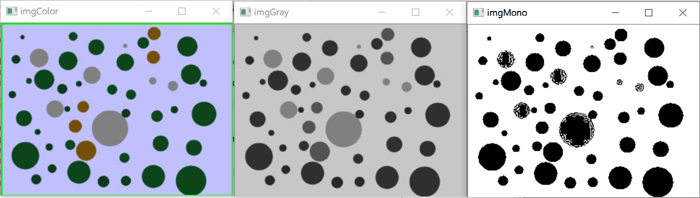
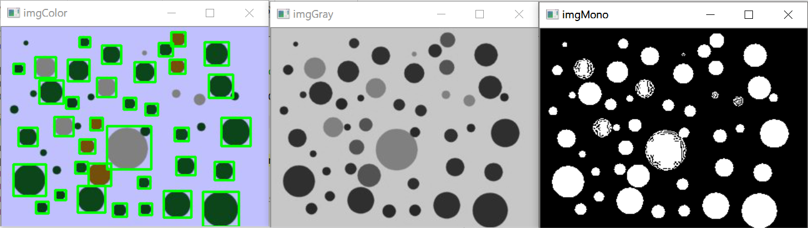
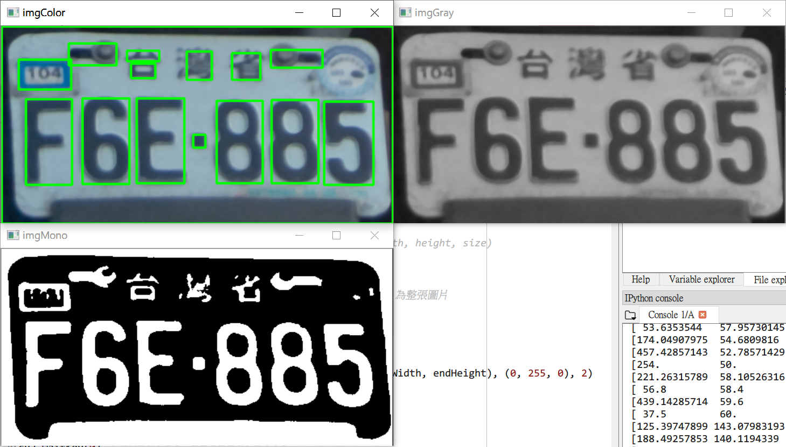

# C5
## Labeling(ConnectedComponents)
* 在一個影像中，將不同的物件分開標記
* 做標記的時候通常都會先做二值化，0(黑)的時候不標記、1(白)的時候標記
* 標記時有分為`4 鄰居`與`8 鄰居`，`8 鄰居`還包含對角線的連接
* 須注意 labeling 為找 1(白色)，因此如果要找的物件二值化後為黑色，記得先透過`cv2.bitwise_not(imgMono)`將顏色對調
    * 顏色對調前：
    * 顏色對調後（能正確辨識標籤）：
* 雜訊會影響處理的結果，因此有兩個解決方案：
    1. 先透過 filter 處理過（如 medium filter）
    2. 忽略尺寸很小的 label
* `centroid`為圓心，並非圖片的中心
    * 

### Process
1. 由左而右、由上而下掃描圖片，如果相鄰的像素皆為背景像素(0)，會賦予一個未用過的新標籤
2. 如果相鄰的像素(註1)不為背景像素，則賦予相同的標籤給新的像素
3. 如果相鄰的像素數值相同，

* 註1：因為是由左而右、由上而下處理，因此相鄰的像素只針對左邊及上面的像素

* connectedComponent.py
```py
import cv2

path = 'C:/Users/lin/Desktop/pics/figures/edge detection and segmentation/complex.jpg'
imgColor = cv2.imread(path)
imgGray = cv2.cvtColor(imgColor, cv2.COLOR_BGR2GRAY) # 灰階影像
ret, imgMono = cv2.threshold(imgGray, 128, 255, cv2.THRESH_BINARY) # 二值化影像

connectivity = 4
output = cv2.connectedComponentsWithStats(imgMono, connectivity, cv2.CV_32S)
print(output[0]) # the number of label
print(output[1]) # the label matrix
print(output[2]) # the stat matrix(startWidth, startHeight, width, height, size)
print(output[3]) # the centroid matrix

# 在標籤周圍畫上寬度為 2 的綠線
for i in range(1, output[0]): # 範圍從 1 開始，排除 output[0][0] 為整張圖片
    if output[2][i][4] > 100: # 只顯示大小超過 100 的標籤
        startWidth = output[2][i][0]
        startHeight = output[2][i][1]
        endWidth = startWidth + output[2][i][2]
        endHeight = startHeight + output[2][i][3]
        cv2.rectangle(imgColor, (startWidth, startHeight), (endWidth, endHeight), (0, 255, 0), 2)

cv2.imshow('imgColor', imgColor)
cv2.imshow('imgGray', imgGray)
cv2.imshow('imgMono', imgMono)

cv2.waitKey(0)
cv2.destroyAllWindows()
```
* Console output
```py
4 # 0. the number of label
[[0 0 0 ... 0 0 0]
 [0 0 0 ... 0 0 0]
 [0 0 0 ... 0 0 0]
 ...
 [0 0 0 ... 0 0 0]
 [0 0 0 ... 0 0 0]
 [0 0 0 ... 0 0 0]] # the label matrix
[[    0     0   172   140 15627]
 [   28     9    51    31  1401]
 [   88     9    41    31  1271]
 [   28    79   131    51  5781]] # the stat matrix(startWidth, startHeight, endWidth, endHeight, size)
[[ 86.71760415  64.71862802]
 [ 53.          24.        ]
 [108.          24.        ]
 [ 85.1380384  103.45511157]] # the centroid matrix
```
* 輸出結果：


## 車牌辨識
* 如何辨識英文與數字：
    * 大小
    * 比例
* 如果辨識的標籤有問題，可以透過更改二值化的閾值調整

### Process
1. 先從圖片中擷取出車牌的區域
2. 從車牌中識別出英文與數字的標籤
3. 透過 OCR，將標籤轉換為英文與數字的文字

* licensePlateRecognition.py
```py
import cv2

path = 'C:/Users/lin/Desktop/pics/2874-1.png'
imgColor = cv2.imread(path)
imgGray = cv2.cvtColor(imgColor, cv2.COLOR_BGR2GRAY)
ret, imgMono = cv2.threshold(imgGray, 100, 255, cv2.THRESH_BINARY)
imgMono = cv2.bitwise_not(imgMono)

connectivity = 4
output = cv2.connectedComponentsWithStats(imgMono, connectivity, cv2.CV_32S)
print(output[0]) # the number of label
print(output[1]) # the label matrix
print(output[2]) # the stat matrix(startWidth, startHeight, width, height, size)
print(output[3]) # the centroid matrix

# 在標籤周圍畫上寬度為 2 的綠線
for i in range(1, output[0]): # 範圍從 1 開始，排除 output[0][0] 為整張圖片
    if output[2][i][4] > 100: # 只顯示大小超過 100 的標籤
        startWidth = output[2][i][0]
        startHeight = output[2][i][1]
        endWidth = startWidth + output[2][i][2]
        endHeight = startHeight + output[2][i][3]
        cv2.rectangle(imgColor, (startWidth, startHeight), (endWidth, endHeight), (0, 255, 0), 2)

cv2.imshow('imgColor', imgColor)
cv2.imshow('imgGray', imgGray)
cv2.imshow('imgMono', imgMono)

cv2.waitKey(0)
cv2.destroyAllWindows()
```

* 輸出結果：
