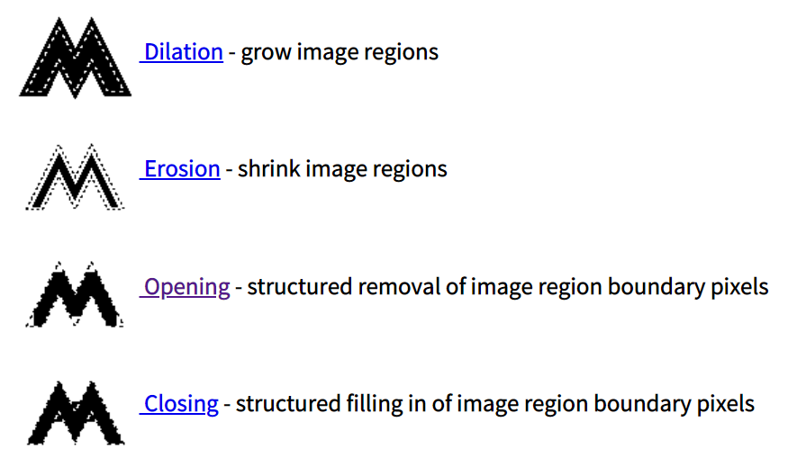
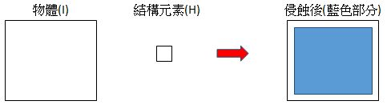
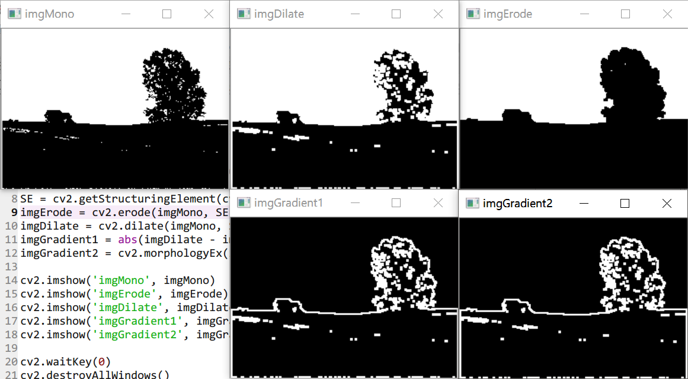
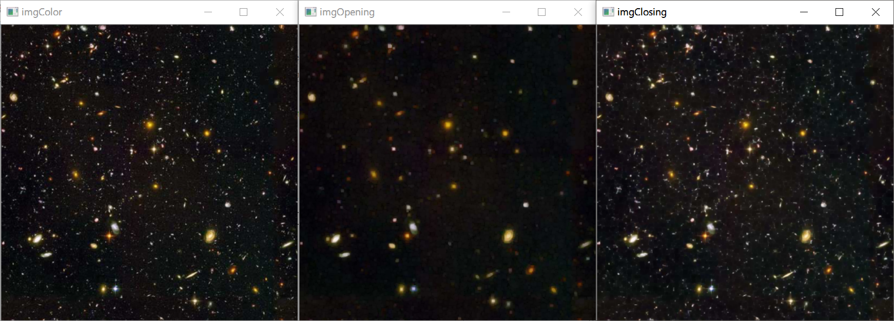
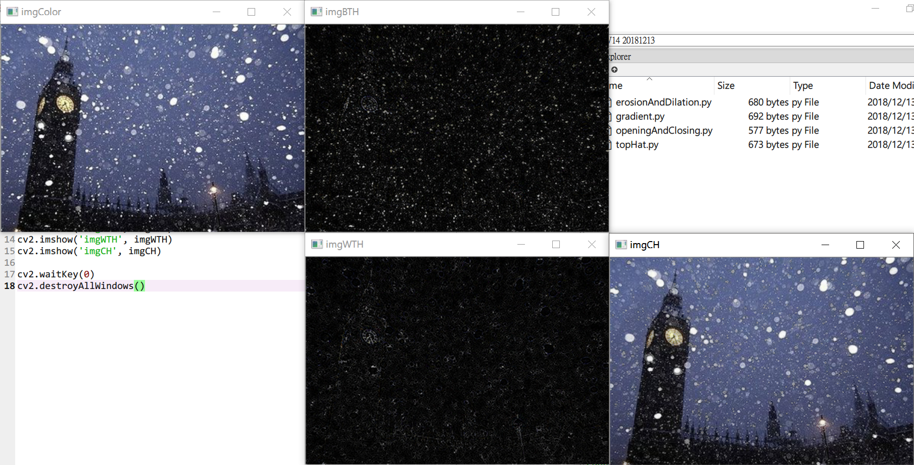

# Morphology 形態(影像)學
* 參考(推薦)：[Morphology](http://homepages.inf.ed.ac.uk/rbf/HIPR2/morops.htm)
* 參考：[Morphological Transformations — OpenCV-Python Tutorials 1 documentation](https://opencv-python-tutroals.readthedocs.io/en/latest/py_tutorials/py_imgproc/py_morphological_ops/py_morphological_ops.html)
* 一般針對黑白照片作處理
* 需要兩個輸入：original image, Structuring Element/kernel
    * 照片會根據 Structuring Element, SE 作處理
* 常見的有這四種：
    1. Erosion ε/⊖
    2. Dilation δ/⊕
    3. Opening γ/◦
    4. Closing ϕ/•
    5. White Top-Hat, WTH
    6. Black Top-Hat, BTH
* 

## Structing Element, SE（kernel）
* 影像的偏移主要考慮中心點(origin)
* 有內建的方法：`cv2.getStructuringElement()`

## Erosion and Dilation
* 是針對**白色**做侵蝕與擴張
    * 註：若前景顏色為黑色，可以採用 `cv2.bitwise_not` 方法來對調顏色
* 對主體做侵蝕，相當於對外部做擴張

### Erosion（侵蝕/細化） 
* 
* 符號：ε（Epsilon）
* B對A進行侵蝕：A⊖B
* 取交集
* 能夠去除雜訊（只要雜訊半徑小於 SE，就能夠將雜訊去除掉）
* 內建的方法：`cv2.erode()`

### Dilation（擴張）
* 與侵蝕剛好相反
* 符號：δ（delta）
* B對A進行膨脹：A⊕B
* 取聯集
* 應用：文字的粗體
* 能夠將洞或縫隙補起來
* 內建的方法：`cv2.dilate()`

erosionAndDilation.py
```py
import cv2

path = "C:/Users/lin/Desktop/pics/Morphology/chi200.bmp"
imgColor = cv2.imread(path)
imgGray = cv2.cvtColor(imgColor, cv2.COLOR_BGR2GRAY)
ret, imgMono = cv2.threshold(imgGray, 128, 255, cv2.THRESH_BINARY)

# Resize
height, width = imgMono.shape[0:2]
imgMono = cv2.resize(imgMono, (int(width*0.6), int(height*0.6)))

SE = cv2.getStructuringElement(cv2.MORPH_RECT, (3, 3))
imgErode = cv2.erode(imgMono, SE)
imgDilate = cv2.dilate(imgMono, SE)

#cv2.imshow('imgColor', imgColor)
#cv2.imshow('imgGray', imgGray)
cv2.imshow('imgMono', imgMono)
cv2.imshow('imgErode', imgErode)
cv2.imshow('imgDilate', imgDilate)

cv2.waitKey(0)
cv2.destroyAllWindows()
```

* 輸出結果：

* 盡可能讓前景保持白色，因為是針對**白色**做侵蝕與擴張
    * 註：若前景顏色為黑色，可以採用 `cv2.bitwise_not` 方法來對調顏色

## Gradient（梯度/邊界）
* 如果只要尋找水平或垂直的邊界，可以將 SE 的`(3,3)`分別更改為`(1,3)`與`(3,1)`
* 有兩種實踐的方法：
    1. 透過 dilation - erosion，能找出邊界（搭配`abs`取絕對值，因為顏色沒有負值）
    2. 內建的方法：`gradient = cv2.morphologyEx(img, cv2.MORPH_GRADIENT, kernel)`

gradient.py
```py
import cv2

path = "C:/Users/lin/Desktop/pics/figures2/landscape1.bmp"
imgColor = cv2.imread(path)
imgGray = cv2.cvtColor(imgColor, cv2.COLOR_BGR2GRAY)
ret, imgMono = cv2.threshold(imgGray, 128, 255, cv2.THRESH_BINARY)

SE = cv2.getStructuringElement(cv2.MORPH_RECT, (3, 3))
imgErode = cv2.erode(imgMono, SE)
imgDilate = cv2.dilate(imgMono, SE)
# 2 methods
imgGradient1 = abs(imgDilate - imgErode)
imgGradient2 = cv2.morphologyEx(imgMono, cv2.MORPH_GRADIENT, SE)

cv2.imshow('imgMono', imgMono)
cv2.imshow('imgErode', imgErode)
cv2.imshow('imgDilate', imgDilate)
cv2.imshow('imgGradient1', imgGradient1)
cv2.imshow('imgGradient2', imgGradient2)

cv2.waitKey(0)
cv2.destroyAllWindows()
```

* 輸出結果：


## Opening and Closing
### Opening（斷開）
* 符號：γ
* `f◦s = (f⊖s)⊕s`
* 先做侵蝕再擴張
* 能用來過濾雜訊、去除毛邊
* 如果 SE 並非對稱的，那再做侵蝕後須先 Transpose(轉置)，否則影像會偏移

#### Area Opening
* 可以用來去除特定區塊的畫面

### Closing（閉合）
* 符號：ϕ
* `f•s = (f⊕s)⊖s`
* 先做擴張再侵蝕（與 Opening 相反）
* 雜訊不但保留，還會放大

openingAndClosing.py
```py
import cv2

path = "C:/Users/lin/Desktop/pics/figures/astronomy and sky pictures/hubble1.jpg"
imgColor = cv2.imread(path)

# resize
height, width = imgColor.shape[0:2]
imgColor = cv2.resize(imgColor, (int(height*0.7), int(width*0.7)))

SE = cv2.getStructuringElement(cv2.MORPH_RECT, (3, 3))
imgOpening = cv2.morphologyEx(imgColor, cv2.MORPH_OPEN, SE)
imgClosing = cv2.morphologyEx(imgColor, cv2.MORPH_CLOSE, SE)

cv2.imshow('imgColor', imgColor)
cv2.imshow('imgOpening', imgOpening)
cv2.imshow('imgClosing', imgClosing)

cv2.waitKey(0)
cv2.destroyAllWindows()
```

* 輸出結果：

## Top-Hat（頂帽變換）
### White Top-Hat, WTH / Top-Hat
* 原圖 - opening

### Black Top-Hat, BTH / Bottom-Hat
* closing - 原圖

### 對比度增強
* 原圖 - opening + closing

topHat.py
```py
import cv2

path = "C:/Users/lin/Desktop/pics/figures/uneven illumination, shadows, textures/London_snow.jpg"
imgColor = cv2.imread(path)

SE = cv2.getStructuringElement(cv2.MORPH_RECT, (3, 3))
imgBTH = cv2.morphologyEx(imgColor, cv2.MORPH_TOPHAT, SE)
imgWTH = cv2.morphologyEx(imgColor, cv2.MORPH_BLACKHAT, SE)
imgCH = cv2.add(imgColor, imgBTH)
imgCH = cv2.subtract(imgCH, imgBTH)

cv2.imshow('imgColor', imgColor)
cv2.imshow('imgBTH', imgBTH)
cv2.imshow('imgWTH', imgWTH)
cv2.imshow('imgCH', imgCH)

cv2.waitKey(0)
cv2.destroyAllWindows()
```

* 輸出結果：
* 可以看出 imgCH 的雪花(白色)變更亮