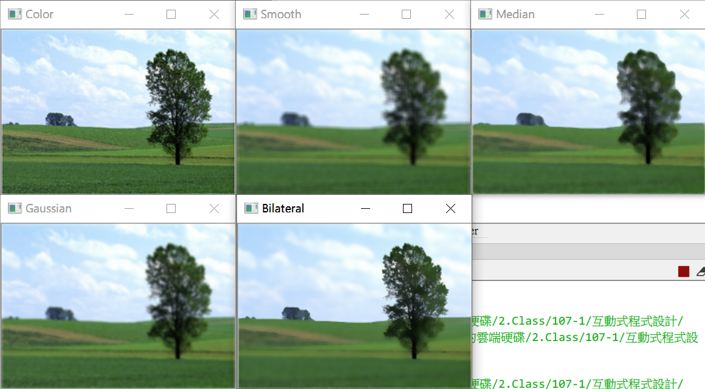
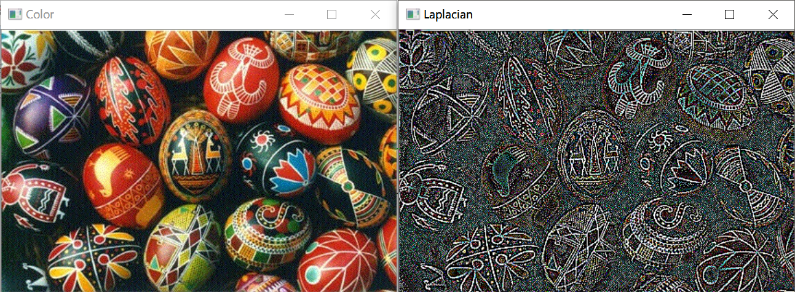
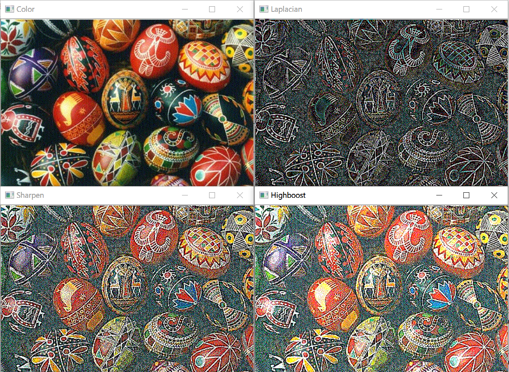

# C4 模糊、銳化處理
### Neightbor of Pixels
* 分為四鄰居、八鄰居
* Connectivity：如果在 Pixel 九宮格旁的 4/8 中，則圈再一起

### Distance Measurement
* 分為歐基里德、市街、棋盤距離
* 因為歐基里德計算較麻煩，因此在影像處理中大多使用後兩者的距離

## Image Blurring / Filter(濾鏡)
> 參考：[OpenCV: Smoothing Images](https://docs.opencv.org/3.1.0/d4/d13/tutorial_py_filtering.html)
* 在轉換後，被捨棄的周圍會被賦予原本的值，以避免沒有數值
### 1. Average / Smoothing Filter
* 不但可以模糊化，還可以減少雜訊
* 也會將銳利的邊緣模糊化
* **期中考會考 Smoothing Filter 轉換**

### 2. Median(中值) Filter
* 取中值，而非平均值
* 能模擬水彩畫的效果

### 3. Gaussian Filter
* 越中間的數值權重越大，反之亦然

### 4. Bilateral Filter(雙邊濾波器)
* 相較於高斯濾鏡只考慮顏色，他還考慮亮度差異，因此不會將邊緣模糊
* 優點：能非常好地處理不想要的噪點，但卻又能保持邊緣銳利
* 缺點：相較於前述的濾鏡，處理速度較慢
* 適合用來美顏
* 也能拿來做卡通化的效果

### 不同濾鏡的效果比較：


```py
import cv2

path = "C:/Users/lin/Desktop/pics/figures2/landscape1.bmp"
imgColor = cv2.imread(path)
imgGray = cv2.cvtColor(imgColor, cv2.COLOR_BGR2GRAY)
imgSmoothing = cv2.blur(imgColor, (5, 5))
imgMedian = cv2.medianBlur(imgColor, 5)
imgGaussian = cv2.GaussianBlur(imgColor, (5, 5), 0) # 注意 G 為大寫
imgBilateral =cv2.bilateralFilter(imgColor, 9, 75, 75)

cv2.imshow('Color', imgColor)
cv2.imshow('Smooth', imgSmoothing)
cv2.imshow('Median', imgMedian)
cv2.imshow('Gaussian', imgGaussian)
cv2.imshow('Bilateral', imgBilateral)

cv2.waitKey(0)
cv2.destroyAllWindows()
```

### 5. Sharpening Filter(銳化濾波)
* 透過微分，凸顯細微的變化或模糊的細節
* 一階微分找斜率，二階微分找極值(最大值或最小值)
    * 一階微分(First-order Dirivatives)
        * 找邊界
    * 二階微分(Second-order Dirivatives)
        * 找細線或孤立點
* 

#### 銳化(Sharpen) = 原圖 + 細節
    * 不用每次都需要連接的步驟，可以簡化遮罩以節省資源
    * 4 -> 5, 8 -> 9

#### High-boost filtering(高增值濾波)
* 不只調整細節，還將亮度做調整
---
* 
```py
import cv2
import numpy as np

path = "C:/Users/lin/Desktop/pics/figures/general pictures/eggsUkraine.jpg"
imgColor = cv2.imread(path)

kernel = np.array([[-1, -1, -1], [-1, 8, -1], [-1, -1, -1]]) # 建立 mask
imgLaplacian = cv2.filter2D(imgColor, -1, kernel)

kernel = np.array([[-1, -1, -1], [-1, 9, -1], [-1, -1, -1]])
imgSharpen = cv2.filter2D(imgColor, -1, kernel)

kernel = np.array([[-1, -1, -1], [-1, 9.7, -1], [-1, -1, -1]])
imgHighboost = cv2.filter2D(imgColor, -1, kernel)

cv2.imshow('Color',  imgColor)
cv2.imshow('Laplacian', imgLaplacian)
cv2.imshow('Sharpen', imgSharpen)
cv2.imshow('Highboost', imgHighboost)

cv2.waitKey(0)
cv2.destroyAllWindows()
```

### 鈍化濾波