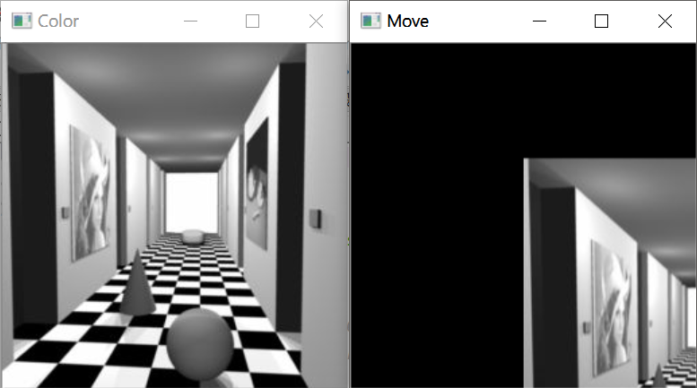
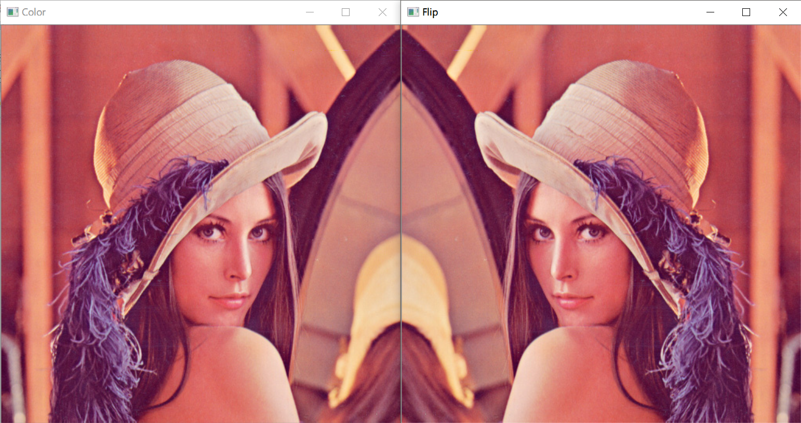
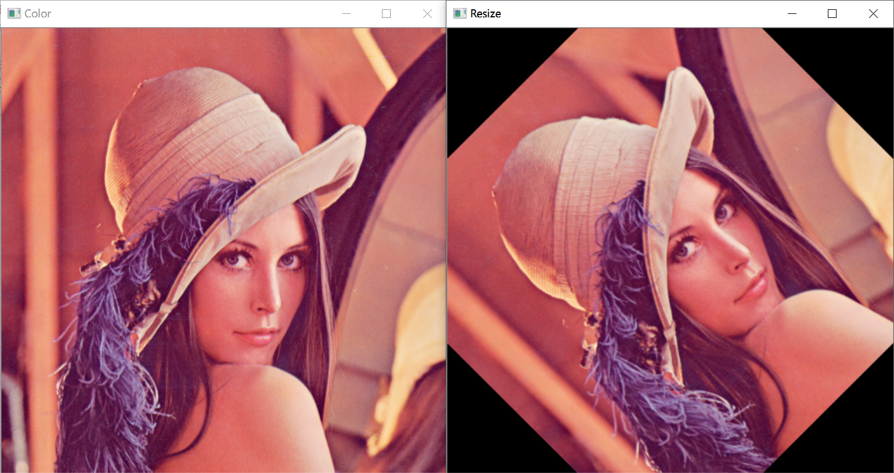
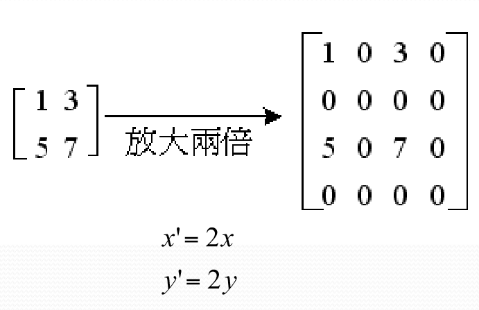
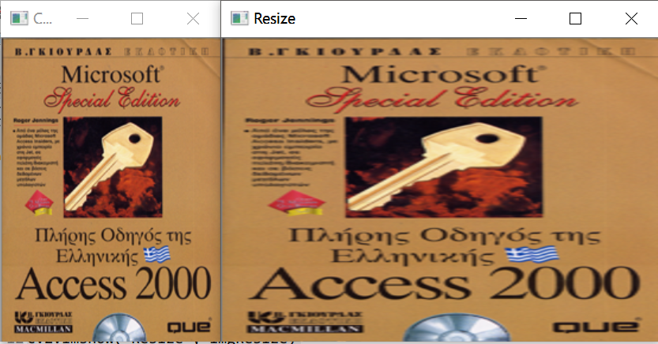
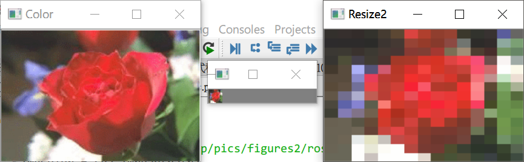
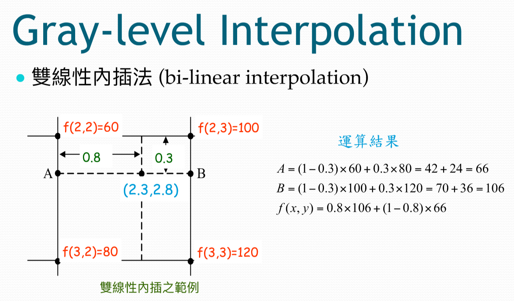

# C4 影像幾何轉換
* 英文：Image Geometric Trasformation
## 座標變換
* 英文：Coordinate Transformation
* 應用：將解析度低轉換成解析度高的圖片
* 轉換過程：丟入一組 x, y，再透過`轉換函式`產出目標圖片
    * 轉換函式為一矩陣
    * 相反的過程稱為`反轉換`
* 常見作法：水平(垂直)平移、水平(垂直)鏡射/翻轉、旋轉、縮放
    * 外接攝影機時影像左右相反，因此需要使用水平翻轉來修正

### 水平與垂直平移：
* [OpenCV: Geometric Transformations of Images](https://docs.opencv.org/3.4.2/da/d6e/tutorial_py_geometric_transformations.html)
```py
# transform.py
import cv2
import numpy as np

path = 'C:/Users/lin/Desktop/pics/figures/edge detection and segmentation/corridor.jpg'
imgColor = cv2.imread(path)

# M 為轉換函式
# M = np.float32([[1, 0, 100], [0, 1, 50]]) # x 移動 100, y 移動 50
# M = np.float32([[1, 0, -100], [0, 1, -50]]) # x 向左移動 100, y 向左移動 50

rows, cols = imgColor.shape[0:2] # 注意此 tuple 中的屬性分別為高(height)、寬(width)，而非先寬再高
M = np.float32([[1, 0, cols/2], [0, 1, rows/3]]) # x 向右移動 1/2, y 向右移動 1/3
imgTranslate = cv2.warpAffine(imgColor, M, (imgColor.shape[0:2])) # imgColor Tuple 有三個屬性，分別為高(height)、寬(width)與深度
print(imgTranslate.shape)

cv2.imshow('Color', imgColor)
cv2.imshow('Move', imgTranslate)

cv2.waitKey(0)
cv2.destroyAllWindows()
```
* 執行結果：

### 水平翻轉：
* [Operations on Arrays — OpenCV 2.4.13.7 documentation](https://docs.opencv.org/2.4/modules/core/doc/operations_on_arrays.html#flip)
* flipCode
    * `= 0` ：垂直翻轉
    * `> 0` ：水平翻轉（值如 1）
    * `< 0` ：垂直且水平翻轉（值如 -1）

```py
# flip.py
import cv2
import numpy as np

path = 'C:/Users/lin/Desktop/pics/figures2/Lena.jpg'
imgColor = cv2.imread(path)

imgFlip = cv2.flip(imgColor, 1) # flipCode = 1，因此做水平翻轉

cv2.imshow('Color', imgColor)
cv2.imshow('Flip', imgFlip)

cv2.waitKey(0)
cv2.destroyAllWindows()
```
* 執行結果：

### 旋轉
* 帶入線性變換的公式
* 公式：
* 須注意預設旋轉的方向為逆時針

```py
# rotation.py
import cv2
import numpy as np

path = 'C:/Users/lin/Desktop/pics/figures2/key.bmp'
imgColor = cv2.imread(path)
height, width = imgColor.shape[0:2]
print(width, height)

imgResize = cv2.resize(imgColor, (width * 2, height))

cv2.imshow('Color', imgColor)
cv2.imshow('Resize', imgResize)

cv2.waitKey(0)
cv2.destroyAllWindows()
```
* 執行結果：

### 縮放
* 直接將 x, y 乘以縮放的倍率
* 如果直接乘以指定的倍率，放大時中間會產生黑線
* 
* 須注意函式的 parameter，例如下方程式碼中，兩行程式的長寬上下剛好顛倒
* 馬賽克效果能透過 `cv2.resize` 方法搭配最近鄰居內插法產生，先縮小再放大

```py
# resize.py
import cv2
import numpy as np

path = 'C:/Users/lin/Desktop/pics/figures2/key.bmp'
imgColor = cv2.imread(path)
height, width = imgColor.shape[0:2] # 先長再寬
print(width, height)

imgResize = cv2.resize(imgColor, (width * 2, height)) # 先寬再長

cv2.imshow('Color', imgColor)
cv2.imshow('Resize', imgResize)

cv2.waitKey(0)
cv2.destroyAllWindows()
```
* 執行結果：

* 馬賽克效果
```py
# mosaic.py
import cv2
import numpy as np

path = 'C:/Users/lin/Desktop/pics/figures2/rose.bmp'
imgColor = cv2.imread(path)

height, width = imgColor.shape[0:2]
imgResize = cv2.resize(imgColor, (15, 15))

# height, width = imgResize.shape[0:2]
imgResize2 = cv2.resize(imgResize, (width, height), interpolation = cv2.INTER_NEAREST) # 要記得寫 interpolation = 

cv2.imshow('Color', imgColor)
cv2.imshow('Resize', imgResize)
cv2.imshow('Resize2', imgResize2)

cv2.waitKey(0)
cv2.destroyAllWindows()
```

* 執行結果：

#### 常見內插法
1. `cv2.INTER_NEAREST`：最近鄰居內插法/替代內插法/零階內插：直接填入最近鄰居的數值，缺點：會有鋸齒
2. `cv2.INTER_LINEAR`：線性內插法
    * 單線性內插法：計算一條線上的均值
    * 雙線性內插法：計算兩條線上的均值
        * **期中考會考：計算雙線性內插法要填補的值**
        * 內容在投影片 C4 第 84 頁
        * 
        * 先分別計算 A, B 兩點的數值，再由此兩點推算最終的數值
4. `cv2.INTER_CUBIC`：三次迴旋積，效果最好

### 歪曲
* 正方形會變成平行四邊形

---

### 期中考
* TODO：做一次類似的題目看看
* TODO：將小抄放在 A4 大小的檔案中
* 範圍：C1 ~ C4
* 提早一週考試
    * W8：會透露期中考題目
    * W9：期中考

#### 題型
* 問答題 6 題，分數隨難度調整

#### 題目
##### 選擇題
* 基本上是送分題

##### 問答題
* C1 送分題：請問影像處理可以用在哪些領域？請舉例使用情形
    * 字數越多分數越高
* C2：將取樣或量化的結果畫出來
* C3：直方圖等化轉換
    * 一張是；一張是累積圖
    * 為題組，可能包括兩題：一個為
* C4：濾波器轉換
    * 也是題組，可能會有 2~3 小題
    * 如正片、負片、旋轉、平移
    * 怎麼回答？回答灰階的數據
* C4：計算雙線性內插法要填補的值
    * 可參考本檔案上方
* 給一組數值，找出彩色、灰階、二值化轉換後的數值

#### 考試規則
* 考試時間：2018/11/8 9:00 開始考
* 應試時間：90 分鐘，可以提早教卷
* 考試時能帶一張 A4 的紙進考場

### 期末考
* 為報告的形式